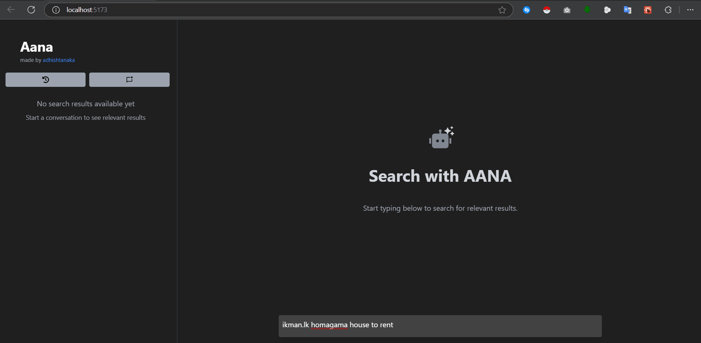
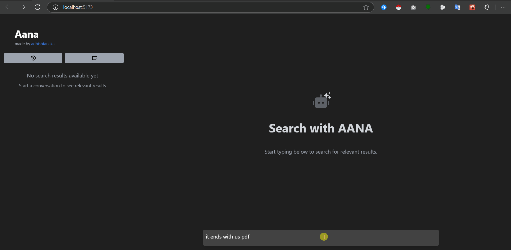

# AANA - AI-Powered Search 
AANA is a search engine that uses artificial intelligence to provide smart search results and real-time responses. It incorporates web scraping and uses various techniques to minimize token waste. The project is built with React for the frontend and Python for the backend, without relying on AI frameworks like LangChain or LlamaIndex. 


## Features
- **Real-time Search Integration**: Display search results alongside chat, with indicators for relevance.
- **Two View Modes**:
  - **Chat View**: A modern chat interface supporting markdown, code blocks, and embedded content.
  - **Search Results**: An interactive sidebar displaying relevant search results and summaries.
- **Rich Content Support**:
  - Video embedding with download options.
  - PDF downloading option 
  - Location data visualization.
  - Image & Table display.
- **History Management**: Save and manage search histories with timestamp tracking.


## Requirements
- Node.js (v14 or higher) with npm or pnpm
- Python 3.8 or higher
- uv (recommended) or pip for Python package management
- Google Gemini API key
- Serper API key

## Installation

### Frontend Setup
```bash
# Clone repository
git clone https://github.com/Adhishtanaka/aana. aana
cd aana

# Install dependencies
pnpm i 

# Start development server
pnpm run dev
```

### Backend Setup

The application requires environment variables to be set in a `.env` file:

```env
Gemini_API_KEY=your_gemini_api_key_here
SERPER_API_KEY=your_serper_api_key_here
```

#### Option 1: Using uv (Recommended)
```bash
# Navigate to backend directory
cd api

# Install dependencies with uv (automatically creates virtual environment)
uv sync

# Start server
uv run fastapi run index.py
```

#### Option 2: Using pip
```bash
# Navigate to backend directory
cd api

# Create virtual environment
python -m venv .venv
source .venv/bin/activate  # Windows: .venv\Scripts\activate

# Install dependencies from pyproject.toml
pip install -e .

# Start server
fastapi run index.py
```

### Available Services
- **Frontend**: http://localhost:3000 (production) or http://localhost:5173 (development)
- **Backend API**: http://localhost:8000

## Project Structure

```
aana/
├── src/                    # Frontend React application
│   ├── components/         # Reusable UI components
│   ├── hooks/             # Custom React hooks
│   ├── services/          # API communication
│   └── types/             # TypeScript definitions
├── api/                   # Backend FastAPI application
│   ├── utils/             # Backend utilities
│   │   ├── qubecrawl.py   # Web scraping and content extraction
│   │   └── serper_client.py # Serper API integration
│   ├── pyproject.toml     # Python dependencies and project config
│   └── index.py           # Main FastAPI application
└── README.md              # This file
```

## Development Commands

### Frontend
```bash
pnpm run dev      # Start development server
pnpm run build    # Build for production
pnpm run preview  # Preview production build
pnpm run lint     # Run ESLint
```

### Backend
```bash
# With uv
uv run fastapi dev index.py    # Development with auto-reload
uv run fastapi run index.py    # Production mode

# With pip
fastapi dev index.py           # Development with auto-reload
fastapi run index.py           # Production mode
```

## Usage
1. Start both frontend and backend servers 
2. Open http://localhost:5173/ in your browser
3. Enter your question in the chat input
4. View related search results in the sidebar
5. Click on search results to get AI-powered insights

## Screenshots

- **Searching and web scraping**



- **Map Support**


- **pdf Support**



- **Video Support** 


## License
This project is open source and available under the [MIT License](LICENSE).

## Contact

- **Author**: [Adhishtanaka](https://github.com/Adhishtanaka)
- **Email**: kulasoooriyaa@gmail.com

## Contributing
Found a bug or want to suggest an improvement? Feel free to open an issue or pull request on the [GitHub repository](https://github.com/Adhishtanaka/aana./pulls).
