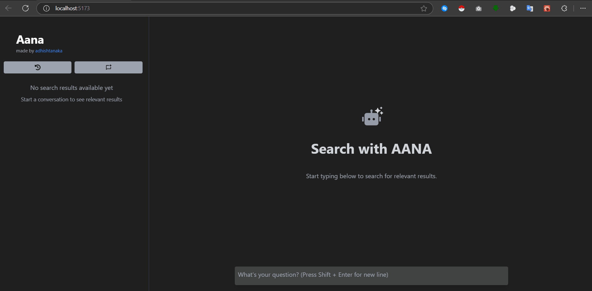

# AANA - AI-Powered Search 
AANA is a search engine that uses artificial intelligence to provide smart search results and real-time responses. It incorporates web scraping and uses various techniques to minimize token waste. The project is built with React for the frontend and Python for the backend, without relying on AI frameworks like LangChain or LlamaIndex. 



## Features
- **Real-time Search Integration**: Display search results alongside chat, with indicators for relevance.
- **Two View Modes**:
  - **Chat View**: A modern chat interface supporting markdown, code blocks, and embedded content.
  - **Search Results**: An interactive sidebar displaying relevant search results and summaries.
- **Rich Content Support**:
  - Video embedding with download options.
  - PDF downloading option 
  - Location data visualization.
  - Image & Table display.
- **History Management**: Save and manage search histories with timestamp tracking.


## Requirements
- Node.js (v14 or higher) with pnpm
- Python 3.8 or higher
- Google Gemini API key

## Installation

### Frontend Setup
```bash
# Clone repository
git clone https://github.com/Adhishtanaka/aana.
cd aana

# Install dependencies
pnpm i

# Start development server
pnpm run dev
```

### Backend Setup

The application requires environment variables to be set in a `.env` file:

```env
Gemini_API_KEY=your_gemini_api_key_here
SERPER_API_KEY=your_serper_api_key_here
```
then ,

```bash
# Navigate to backend directory
cd api

# Create virtual environment
python -m venv venv
source venv/bin/activate  # Windows: venv\Scripts\activate

# Install dependencies
pip install -r requirements.txt

# Start server
fastapi run index.py
```
## Usage
1. Start both frontend and backend servers
2. Open http://localhost:5173/ in your browser
3. Enter your question in the chat input
4. View related search results in the sidebar
5. Click on search results to get AI-powered insights


## License
This project is open source and available under the [MIT License](LICENSE).

## Contact

- **Author**: [Adhishtanaka](https://github.com/Adhishtanaka)
- **Email**: kulasoooriyaa@gmail.com

## Contributing
Found a bug or want to suggest an improvement? Feel free to open an issue or pull request on the [GitHub repository](https://github.com/Adhishtanaka/aana./pulls).
